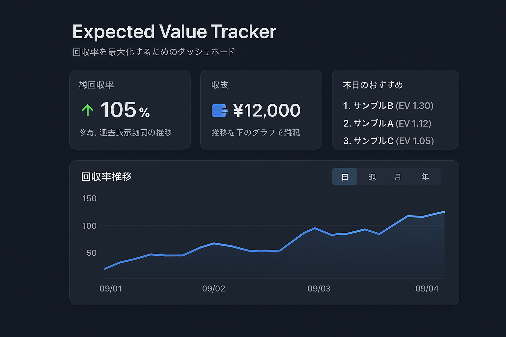

## 競馬 EV ツール 要件定義（SRS v0.3）

### 1. ビジョン / 成功条件

- 目的: 回収率向上
- 概要: 出馬リスト全頭を S〜D で評価し、期待値の高い馬と推奨買い目を提示
- 特徴: オッズだけでなく、会場傾向・血統・脚質・調教・騎手/厩舎成績を考慮
- KPI: 総回収率
- 利用者: 個人利用（完成度次第で販売も検討）

### 2. スコープ

- 対象主催: 中央競馬（将来：地方対応も検討）
- 券種: 単勝・複勝・馬連・馬単・ワイド・3 連複・3 連単（枠連除外）
- 対象条件: 芝・ダート、距離、クラス、ハンデすべて
- 対象期間: 過去に取得可能な全範囲
- コース傾向分析: 開催別／トラック別／馬場状態別（良〜不良）

### 3. データソース / 取得方法

#### 初期方式

- CSV ファイルの手動取り込み（例：netkeiba、TARGET frontier JV から出力）
- 取り込んだデータを自作 DB へ保存（SQLite 想定）

#### 将来方式

- 公式 API（JRA-VAN DataLab、netkeiba API 等）との連携
- 自動更新（開催当日のレース進行に応じて最新データ取得）

#### 取得データの粒度

- レース情報: 開催日、場、ラウンド、条件（距離、クラス、馬場）
- 馬情報: 馬名、性齢、血統（父・母父・世代）、馬体重、調教、厩舎
- 成績データ: タイム、上がり、通過順、枠番、斤量、人気、騎手成績
- コメント・調教情報: 可能な範囲で取得
- オッズ: 確定オッズ、直近取得時点のオッズ、過去オッズ履歴

#### オッズ取り扱い

- 締切直前のリアルタイム取得は難易度高 → 当面は「確定値＋履歴＋ユーザ入力」
- ユーザが手入力で最新オッズを加え、EV を再計算できる UI を用意

#### 更新頻度

- ボタン押下で随時更新
- 将来は「レース終了後自動反映」や「開催日単位一括更新」も対応可能

#### ライセンス/規約

- スクレイピングは非推奨
- 公式規約準拠の範囲で実装

### 4. 予測・期待値ロジック

- 初期方式: ルールベース＋加重係数（血統適性・騎手成績・当日傾向）
- 将来方式: 統計回帰・機械学習モデル（LightGBM 等）に拡張
- 特徴量: 枠順、脚質、近走指数、血統適性、馬場巧拙、騎手/厩舎成績、斤量、ローテ、コース実績、展開想定、当日傾向
- バイアス補正: 当日 1〜6 レースまでの傾向（先行有利/差し有利、内枠有利など）を自動反映
- EV 定義: EV = 勝率 × オッズ を基本式とする
- 人気補正: 人気薄で過去好走実績のある馬は EV を上方補正

### 5. 資金配分 / ルール

- 判断基準: EV > 1 を基本条件（閾値調整可能）
- 資金管理: ユーザ入力（1 レース上限金額・点数）
- 配分方式：均等割り／ケリー基準／固定額（選択可）
- リスク制御: 最低オッズ・最高オッズフィルタ、人気帯制御（例：複勝 1.1 倍は除外）

### 6. UI/UX（MVP）

#### 入力

- 開催日＋会場＋レース番号（自動でレース名を補完）／CSV アップロード

#### 出力

- 全頭診断テーブル（馬名、評価 S〜D、勝率%、オッズ、EV、根拠）
- 推奨買い目一覧（券種・組み合わせ・資金配分）

#### 可視化

- コース傾向ヒートマップ
- 脚質分布
- 血統適性レーダー
- 勝率 × オッズ散布図

#### 利便性

- ダークモード
- 詳細根拠はテーブル下に展開表示

### 7. 技術・運用

- OS: Mac 優先（Electron で配布）、将来的に Windows 対応
- オフライン対応: 不要（データはローカル DB キャッシュで十分）
- 保存形式: SQLite ＋ CSV 履歴
- ロギング: 不要（予測版数は保存せず、結果のみ保持）
- 購入履歴管理: 買い目と実際の購入額を記録 → 回収率追跡

### 8. 透明性・根拠表示

- 必要: 各馬のスコア内訳（寄与度）表示
- 将来: 特徴量重要度（SHAP 風可視化）

### 9. 検証 / バックテスト

- 検証対象: 直近 2〜3 年の中央競馬
- 指標: 総回収率・ROI・的中率・平均配当・LogLoss
- 方法: 開催別 CV／時系列分割 CV
- 過学習対策: 特徴量上限・正則化

### 10. 法務・倫理

- 注意表示: 自己責任明示は不要（個人利用前提）

### 11. 将来拡張

- 公式 API 連携（JRA-VAN）
- 連系券種の組合せ最適化（シミュレーション/モンテカルロ法）
- 機械学習モデル導入（LightGBM/TensorFlow.js）
- クラウド同期、スマホビュー対応

---

# 実装 TODO

## 1. UI 設計 & 実装（mock データ利用）

- [x] トップページ = ダッシュボード画面
  - [x] サマリカード（総回収率・収支）
  - [x] 日/週/月/年 切り替えタブ
  - [x] 推奨馬券リスト（mock データ表示）
  - [x] 回収率推移グラフ表示
- [ ] レース詳細ページ
  - 馬ごとのオッズ・期待値・ランクをテーブルで表示
- [x] MUI の Card, Tabs, Table, Badge, Chart を用いて構築
- [x] 共通 Card コンポーネントの実装
- [x] テーマ管理システムの実装

## 2. IF 定義

- [x] UI で必要なデータ型を定義（TS 型 / Zod）
- [x] mock データを用意し、UI に流し込んで確認

## 3. UI 完成度向上

- [x] 切り替えタブに応じた表示内容更新（mock で OK）
- [ ] ソート・フィルタ（期待値順、オッズ順、日付など）
- [x] グラフ表示（回収率推移・期待値分布）
- [x] レスポンシブデザイン対応
- [x] カスタムスクロールバー実装

## 4. API 設計 & 実装

- [ ] mock の IF をそのままバックエンド API に置き換え可能にする
- [ ] Next.js API Routes でエンドポイント設計
- [ ] フロントから API 呼び出しテスト

## 5. データ取得・保存

- [ ] ネット競馬 / JRA-VAN API からデータ取得処理
- [ ] データベースに保存（Prisma/TypeORM）
- [ ] 定期取得 or 手動更新機構を追加

## 6. 解析処理

- [ ] 勝率推定ロジック
- [ ] 期待値計算
- [ ] ランク付け（S/A/B/C/D）

## 7. 推奨馬券生成

- [ ] MVP 版：単勝のみ
- [ ] 拡張版：複数券種対応、資金配分ロジック

## 8. インフラ / CI

- [ ] Docker 化
- [x] GitHub Actions CI
- [ ] 環境変数 / Secrets 管理
- [ ] デプロイ（Vercel / Render）

## 9. テスト実装

- [x] 単体テスト（Vitest + Testing Library）
- [x] テストカバレッジ 100% 達成
- [x] コンポーネントテスト
- [x] カスタムフックテスト
- [x] i18n テスト（翻訳キー対応）
- [x] MUI コンポーネントテスト
- [x] userEvent を使用したユーザー操作テスト

