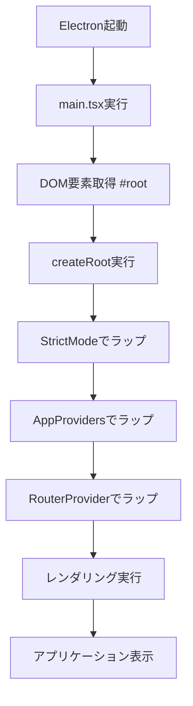

# main.tsx 詳細ドキュメント

## 概要

`main.tsx`は、Electron アプリケーションの**Renderer プロセスのエントリーポイント**です。React アプリケーションを DOM にマウントし、アプリ全体の初期化を行います。

## なぜこのファイルが必要なのか？

### 1. React アプリケーションの起動点

- すべての React アプリケーションには、必ずエントリーポイントが必要
- `index.html`の`#root`要素に React アプリをマウントする役割
- アプリケーションのライフサイクルの起点となる

### 2. Electron 環境での特別な考慮

- 通常の Web アプリとは異なり、Electron の Renderer プロセスで実行される
- メインプロセスとの通信、ファイルシステムアクセスなど、特別な機能が利用可能
- セキュリティコンテキストが通常のブラウザとは異なる

### 3. 開発環境と本番環境の統一

- Vite の開発サーバーでも、Electron の本番環境でも同じコードが動作
- 環境に依存しない設定で、開発効率を向上

## ファイルの詳細

### インポート文の説明

```typescript
import { StrictMode } from 'react';
import { createRoot } from 'react-dom/client';
import './index.css';
import { RouterProvider } from 'react-router';
import AppProviders from './App.tsx';
import { router } from './routes/index.tsx';
```

**各インポートの役割:**

#### `StrictMode`

- **目的**: 開発時に潜在的な問題を検出するための React コンポーネント
- **機能**:
  - 副作用の重複実行
  - 非推奨 API の警告
  - 予期しない副作用の検出
- **注意**: 本番環境では無効化される

#### `createRoot`

- **目的**: React 18 の新しいルート API
- **機能**: 並行レンダリング、Suspense、エラーバウンダリなどの新機能を有効化
- **従来の`ReactDOM.render`との違い**: より柔軟で高性能

#### `'./index.css'`

- **目的**: グローバルスタイルの読み込み
- **内容**: Tailwind CSS のベース、カスタム CSS 変数、リセット CSS

#### `RouterProvider`

- **目的**: React Router v6 のルートプロバイダ
- **機能**: ルーティング状態の管理、ナビゲーションの提供

#### `AppProviders`

- **目的**: アプリ全体のプロバイダを集約したコンポーネント
- **機能**: Suspense、将来的には ThemeProvider、i18nProvider など

#### `{ router }`

- **目的**: ルート定義のインポート
- **内容**: `createMemoryRouter`で作成されたルート設定

### メイン処理の詳細

```typescript
createRoot(document.getElementById('root')!).render(
  <StrictMode>
    <AppProviders>
      <RouterProvider router={router} />
    </AppProviders>
  </StrictMode>
);
```

**処理の流れ:**

1. **DOM 要素の取得**

   - `document.getElementById('root')`: HTML の`#root`要素を取得
   - `!`: TypeScript の非 null アサーション（要素が存在することを保証）

2. **React ルートの作成**

   - `createRoot()`: React 18 のルート API でルートを作成
   - 並行レンダリングなどの新機能が有効化される

3. **コンポーネントツリーの構築**

   - `StrictMode`: 開発時の問題検出
   - `AppProviders`: 共通プロバイダの提供
   - `RouterProvider`: ルーティング機能の提供

4. **レンダリングの実行**
   - `.render()`: 実際に DOM にレンダリングを実行

## 設計思想

### 1. 関心の分離

- ルーティング設定は`routes/index.tsx`に分離
- プロバイダ設定は`App.tsx`に分離
- このファイルは初期化のみに集中

### 2. 型安全性

- TypeScript の非 null アサーション（`!`）で型安全性を確保
- インポート文で依存関係を明確化

### 3. 拡張性

- 新しいプロバイダは`App.tsx`に追加
- 新しいルートは`routes/index.tsx`に追加
- このファイルの変更は最小限に抑制

## 処理フロー



## 注意点

### 1. DOM 要素の存在確認

- `#root`要素が存在しない場合、アプリケーションが起動しない
- `index.html`で要素が定義されていることを確認

### 2. 非 null アサーションの使用

- `!`演算子は、要素が存在することを開発者が保証するもの
- 要素が存在しない場合は実行時エラーが発生

### 3. インポート順序

- CSS ファイルは最初にインポート（スタイルの優先順位）
- 依存関係の順序を考慮したインポート

## 関連ファイル

- `index.html`: `#root`要素の定義
- `src/App.tsx`: プロバイダの集約
- `src/routes/index.tsx`: ルート定義
- `src/index.css`: グローバルスタイル
- `vite.config.ts`: Vite の設定（開発サーバー）

## 将来の拡張予定

### 1. エラーバウンダリの追加

```typescript
<ErrorBoundary>
  <AppProviders>
    <RouterProvider router={router} />
  </AppProviders>
</ErrorBoundary>
```

### 2. 開発者ツールの統合

```typescript
if (process.env.NODE_ENV === 'development') {
  // React DevTools、Redux DevToolsなどの統合
}
```

### 3. パフォーマンス監視

```typescript
// Web Vitals、パフォーマンスメトリクスの収集
```
