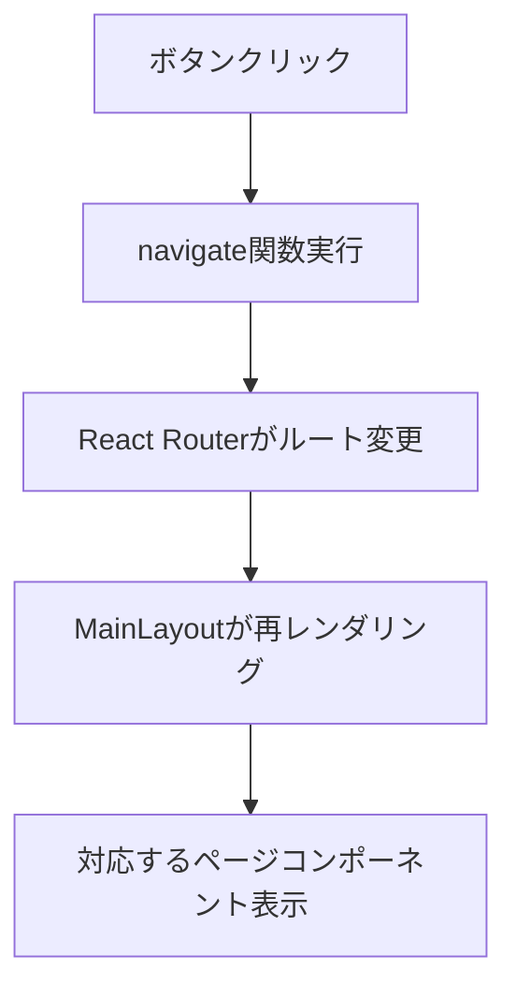

# Dashboard.tsx 詳細ドキュメント

## 概要

`Dashboard.tsx`は、アプリケーションの**ホーム画面**を担当するページコンポーネントです。ユーザーにウェルカムメッセージを表示し、他の主要機能へのナビゲーションを提供します。

## なぜこのコンポーネントが必要なのか？

### 1. アプリケーションの入り口

- ユーザーが最初に目にする画面
- アプリの目的と機能を明確に伝える
- 他の機能への導線を提供

### 2. ユーザビリティの向上

- 各機能へのショートカットボタンを配置
- 直感的なナビゲーションを実現
- アプリの全体像を把握しやすくする

### 3. ブランド体験の提供

- アプリのタイトルと説明を表示
- ユーザーに安心感を与える
- プロフェッショナルな印象を与える

## コンポーネントの詳細

### インポート文の説明

```typescript
import { Button } from '@/components/ui/button.tsx';
import { useNavigate } from 'react-router';
```

**各インポートの役割:**

#### `Button`

- **目的**: shadcn/ui の Button コンポーネント
- **機能**: 統一されたスタイルのボタン UI
- **エイリアス**: `@`は`src/renderer`を指す
- **拡張子**: `.tsx`を明示的に指定

#### `useNavigate`

- **目的**: React Router のナビゲーションフック
- **機能**: プログラムによるページ遷移
- **Electron 対応**: `createMemoryRouter`環境で最適化

### コンポーネント実装の詳細

```typescript
const Dashboard = () => {
  const navigate = useNavigate();
  return (
    <div className='space-y-4'>
      <h2 className='text-2xl font-bold'>ようこそ</h2>
      <p>馬の期待値分析ツールへようこそ！</p>

      <div className='flex gap-4'>
        <Button onClick={() => navigate('/')}>🏠 ダッシュボードへ</Button>
        <Button onClick={() => navigate('/horses')}>🐎 馬一覧へ</Button>
        <Button onClick={() => navigate('/analysis')}>📊 期待値分析へ</Button>
        <Button onClick={() => navigate('/history')}>📜 履歴へ</Button>
      </div>
    </div>
  );
};
```

**詳細説明:**

#### `useNavigate`フック

- **目的**: プログラムによるページ遷移
- **戻り値**: `navigate`関数
- **使用方法**: `navigate('/path')`で指定したパスに遷移
- **Electron 対応**: フルリロードを発生させない

#### JSX 構造

```typescript
<div className='space-y-4'>
```

- **目的**: 子要素間に垂直スペースを追加
- **Tailwind クラス**: `space-y-4`（各子要素の間に 1rem のスペース）

#### タイトル部分

```typescript
<h2 className='text-2xl font-bold'>ようこそ</h2>
<p>馬の期待値分析ツールへようこそ！</p>
```

- **h2 要素**: ページのメインタイトル
- **Tailwind クラス**: `text-2xl font-bold`（大きなフォントサイズ、太字）
- **p 要素**: アプリの説明文
- **目的**: ユーザーにアプリの目的を伝える

#### ナビゲーションボタン

```typescript
<div className='flex gap-4'>
  <Button onClick={() => navigate('/')}>🏠 ダッシュボードへ</Button>
  <Button onClick={() => navigate('/horses')}>🐎 馬一覧へ</Button>
  <Button onClick={() => navigate('/analysis')}>📊 期待値分析へ</Button>
  <Button onClick={() => navigate('/history')}>📜 履歴へ</Button>
</div>
```

**各ボタンの詳細:**

##### ダッシュボードボタン

- **パス**: `/`（現在のページ）
- **アイコン**: 🏠（ホーム）
- **目的**: 現在のページを再表示

##### 馬一覧ボタン

- **パス**: `/horses`
- **アイコン**: 🐎（馬）
- **目的**: 出走馬の一覧表示

##### 期待値分析ボタン

- **パス**: `/analysis`
- **アイコン**: 📊（グラフ）
- **目的**: 期待値の分析・可視化

##### 履歴ボタン

- **パス**: `/history`
- **アイコン**: 📜（巻物）
- **目的**: 購入履歴・回収率の表示

## スタイリングの詳細

### Tailwind CSS クラス

```typescript
className = 'space-y-4'; // 子要素間に垂直スペース
className = 'text-2xl font-bold'; // 大きなフォントサイズ、太字
className = 'flex gap-4'; // フレックスレイアウト、要素間にスペース
```

**各クラスの説明:**

#### `space-y-4`

- **目的**: 子要素間に垂直スペースを追加
- **値**: `1rem`（16px）
- **適用範囲**: 直接の子要素のみ

#### `text-2xl font-bold`

- **text-2xl**: フォントサイズを 1.5rem（24px）に設定
- **font-bold**: フォントウェイトを 700（太字）に設定

#### `flex gap-4`

- **flex**: フレックスボックスレイアウトを有効化
- **gap-4**: 子要素間に 1rem（16px）のスペースを追加

## 設計思想

### 1. シンプルさ

- 必要最小限の要素のみを配置
- 複雑なロジックは含まない
- 直感的な操作を提供

### 2. 一貫性

- shadcn/ui の Button コンポーネントを使用
- 統一されたスタイリング
- 他のページとの一貫性を保持

### 3. アクセシビリティ

- セマンティックな HTML 要素を使用
- 適切な見出し階層
- キーボードナビゲーション対応

## ナビゲーションの動作原理

### 1. ボタンクリック時の処理

```typescript
<Button onClick={() => navigate('/horses')}>
```

1. ユーザーがボタンをクリック
2. `onClick`イベントが発火
3. `navigate('/horses')`が実行
4. React Router がルートを変更
5. 対応するコンポーネントが表示

### 2. ルート変更の流れ



## 将来の拡張予定

### 1. 動的コンテンツの追加

```typescript
// 最近の分析結果を表示
const recentAnalysis = useRecentAnalysis();

return (
  <div className='space-y-4'>
    <h2 className='text-2xl font-bold'>ようこそ</h2>
    <p>馬の期待値分析ツールへようこそ！</p>

    {recentAnalysis && (
      <div className='bg-blue-50 p-4 rounded'>
        <h3>最近の分析結果</h3>
        <p>回収率: {recentAnalysis.returnRate}%</p>
      </div>
    )}

    {/* ナビゲーションボタン */}
  </div>
);
```

### 2. 統計情報の表示

```typescript
// アプリの使用統計を表示
const stats = useAppStats();

return (
  <div className='grid grid-cols-3 gap-4'>
    <div className='bg-white p-4 rounded shadow'>
      <h3>総分析回数</h3>
      <p className='text-2xl font-bold'>{stats.totalAnalysis}</p>
    </div>
    <div className='bg-white p-4 rounded shadow'>
      <h3>平均回収率</h3>
      <p className='text-2xl font-bold'>{stats.averageReturnRate}%</p>
    </div>
    <div className='bg-white p-4 rounded shadow'>
      <h3>今月の分析</h3>
      <p className='text-2xl font-bold'>{stats.monthlyAnalysis}</p>
    </div>
  </div>
);
```

### 3. クイックアクション

```typescript
// よく使用される機能へのクイックアクション
const quickActions = [
  { label: '新規分析', icon: '➕', action: () => navigate('/analysis') },
  { label: '馬データ更新', icon: '🔄', action: () => navigate('/horses') },
  { label: 'レポート出力', icon: '📄', action: () => exportReport() },
];
```

## 注意点

### 1. ナビゲーションの一貫性

- すべてのボタンで`useNavigate`を使用
- `<a>`タグは使用しない（フルリロードを防ぐため）

### 2. アクセシビリティ

- ボタンに適切なラベルを設定
- キーボードナビゲーションに対応
- スクリーンリーダーに対応

### 3. パフォーマンス

- 不要な再レンダリングを避ける
- `useCallback`でイベントハンドラーを最適化（必要に応じて）

## 関連ファイル

- `src/routes/index.tsx`: ルート定義
- `src/renderer/components/ui/button.tsx`: Button コンポーネント
- `src/renderer/components/layout/MainLayout.tsx`: レイアウト
- `src/pages/Horses.tsx`: 馬一覧ページ
- `src/pages/Analysis.tsx`: 分析ページ
- `src/pages/History.tsx`: 履歴ページ

## テスト戦略

### 1. レンダリングテスト

```typescript
it('ダッシュボードが正しく表示されること', () => {
  render(<Dashboard />);
  expect(screen.getByText('ようこそ')).toBeInTheDocument();
  expect(
    screen.getByText('馬の期待値分析ツールへようこそ！')
  ).toBeInTheDocument();
});
```

### 2. ナビゲーションテスト

```typescript
it('ボタンクリック時に正しいページに遷移すること', async () => {
  const user = userEvent.setup();
  render(<Dashboard />);

  await user.click(screen.getByText('🐎 馬一覧へ'));
  expect(mockNavigate).toHaveBeenCalledWith('/horses');
});
```

### 3. アクセシビリティテスト

```typescript
it('キーボードナビゲーションが正しく動作すること', async () => {
  render(<Dashboard />);

  const firstButton = screen.getByText('🏠 ダッシュボードへ');
  firstButton.focus();
  expect(firstButton).toHaveFocus();

  await user.keyboard('{Tab}');
  expect(screen.getByText('🐎 馬一覧へ')).toHaveFocus();
});
```
